+++
title = "This Month in Rust GameDev #5 - December 2019"
date = 2020-01-10
transparent = true
+++

Welcome to the fifth issue of the Rust GameDev Workgroup’s
monthly newsletter.

[Rust] is a systems language pursuing the trifecta:
safety, concurrency, and speed.
These goals are well-aligned with game development.

We hope to build an inviting ecosystem for anyone wishing
to use Rust in their development process!
Want to get involved? [Join the Rust GameDev working group!][join]

Want something mentioned in the next newsletter?
[Send us a pull request][pr].
Feel free to send PRs about your own projects!

[Rust]: https://rust-lang.org
[join]: https://github.com/rust-gamedev/wg#join-the-fun
[pr]: https://github.com/rust-gamedev/rust-gamedev.github.io

<!--
Ideal section structure is:

```
### [Title]


A paragraph or two with a summary and [useful links].

_Discussions:
[/r/rust](https://reddit.com/r/rust/todo),
[twitter](https://twitter.com/todo/status/123456)_

[Title]: https://first.link
[useful links]: https://other.link
```

Discussion links are added only if they contain
some actual interesting discussions.

If needed, a section can be split into subsections with a "------" delimiter.
-->

## [Call for Speakers: Rust London GameDev Meetup][london-call]

> I'm the community lead for [Rust London][london] and I just wanted
> to put out the feelers for anybody who is London based and would like
> to give a talk at our Rust London Meetup.
> We want to hold a special LDN Talks event solely focused on GameDev.

[See the details here][london-call].

[london]: https://meetup.com/Rust-London-User-Group
[london-call]: https://reddit.com/r/rust_gamedev/comments/ecfb3x/a_call_for_speakers_rust_london_meetup_gamedev

## Game Updates

### [A/B Street][abstreet] - Adjust Traffic Patterns in Real Cities

Ever been on a bus stuck in traffic, wondering why there are cars parked on the
road instead of a bus lane?
[A/B Street][abstreet] is a game exploring how small changes to
road space and traffic signals affect the movement of drivers, cyclists,
transit users, and pedestrians. The game models Seattle as accurately as
possible using [OpenStreetMap] and other public datasets, lets the player adjust
existing infrastructure, and then does a detailed comparison to see who the
changes help and hurt.

A/B Street is written in Rust, using a custom GUI library on top of [glium].

[Play it now][abstreet-instructions] and
[start contributing][abstreet-contributing] to
expand the game to more cities, model light rail and shared foot/bike paths,
and work on gameplay modes (like "make everything as slow as possible" and
"what if nobody owned and parked personal vehicles?").


December highlights:

- Preview traffic signal changes "live" without resetting the simulation
- UI: new minimap, popup info panels with graphs, better shapes,
  and colors for cars
- Data viz: histogram showing count of faster/slower trips, visualizing which
  road has the longest backup at a traffic signal, breaking down the timeline
  of a trip (walk to a car, drive somewhere, look for parking, walk to
  destination...)
- Improved pedestrian pathfinding and decisions to use a bus or not

_Discussions:
[/r/rust](https://reddit.com/r/rust/comments/e9h7d4/want_to_work_on_a_traffic_simulation_game)_

[abstreet]: https://github.com/dabreegster/abstreet#ab-street
[abstreet-instructions]: https://github.com/dabreegster/abstreet/blob/master/docs/INSTRUCTIONS.md
[abstreet-contributing]: https://github.com/dabreegster/abstreet/issues
[OpenStreetMap]: https://openstreetmap.org
[glium]: https://github.com/glium/glium

### [vange-rs]

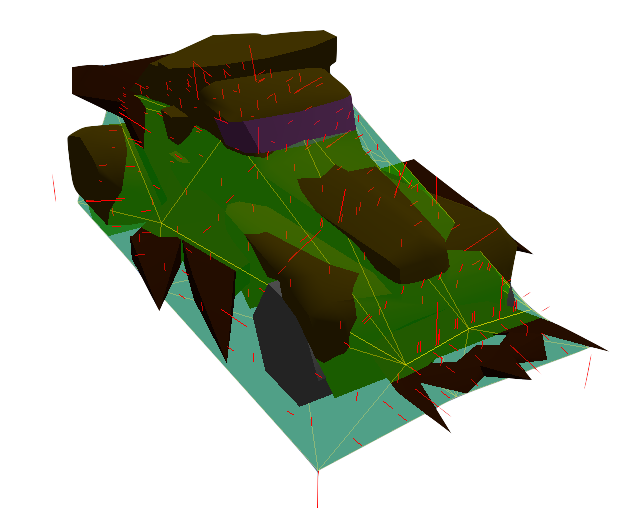

[vange-rs] is the project of re-implementing the [Vangers] game (from 1998)
in Rust using modern development practices, parallel computations, and GPU.

This month, the project has gained a few major features.
The biggest one is an implementation of the physics engine
completely on GPU in a closed loop.
At the same time, the CPU code path was fixed to allow
for a smooth ride ([video][vangers-physics-video]).

Another pack of changes has landed to allow many NPC cars to be riding
the world alongside the user.
The renderer has shifted towards being completely instanced,
and CPU physics computations were parallelized.
The game can now host up to 50000 total cars on the level,
all simulated at once, with up to 5000 on screen at a time
([video][vangers-reddit-4000-cars]).

In minor features, it became possible to jump in the game
as well as change the car color.

The project has also started the [development blog][vangers-devlog],
describing both new and old technology, such as:

- [Data formats][vangers-data-formats] used in the original game.
- [Collision model][vangers-collision-model] of the original game.
- [Pure-GPU implementation][vangers-pure-gpu-impl] of the collision model.

[vange-rs]: https://github.com/kvark/vange-rs
[Vangers]: https://en.wikipedia.org/wiki/Vangers
[vangers-physics-video]: https://reddit.com/r/rust_gamedev/comments/e8r695/vangers_gpu_physics_engine
[vangers-devlog]: http://kvark.github.io/vange-rs
[vangers-reddit-4000-cars]: https://reddit.com/r/rust_gamedev/comments/eg3k6x/spawning_4k_of_cars_in_vangers
[vangers-data-formats]: https://kvark.github.io/vange-rs/2019/12/12/data-formats.html
[vangers-collision-model]: https://kvark.github.io/vange-rs/2019/12/17/collision-model.html
[vangers-pure-gpu-impl]: https://kvark.github.io/vange-rs/2019/12/19/gpu-collisions.html

### [Veloren][veloren]


[Veloren][veloren] is an open world, open-source voxel RPG
inspired by Dwarf Fortress and Cube World.

Some of December's updates:

- A formal changelog
- Pathfinding
- Airshipper launcher progress
- Erosion system improvements
- First animated UI elements

You can read more about some specific topics:

- [Character States Overhaul](https://veloren.net/devblog-48#character-states-overhaul-by-adam)
- [Airshipper Update](https://veloren.net/devblog-46#airshipper-updates-with-songtronix)
- [SFX](https://veloren.net/devblog-46#sfx-with-shandley)
- [Contributor Spotlight: @AngelOnFira](https://veloren.net/devblog-46/#contributor-spotlight-angelonfira)
- [Pathfinding](https://veloren.net/devblog-45/#pathfinding-by-chrischrischris)
- [Mac Build Predicament](https://veloren.net/devblog-44/#lantern-slides-mac-build-predicament)
- [Unfinished Rust CI Blog](https://veloren.net/devblog-44/#lantern-slides-unfinished-rust-ci-blog)


In the works for January include player account authentication,
preliminary modding work, and character state systems.
There are ongoing talks that are also looking
into the networking system and optimizations.

December's full weekly devlogs: "This Week In Veloren...":
[#44](https://veloren.net/devblog-44),
[#45](https://veloren.net/devblog-45),
[#46](https://veloren.net/devblog-46),
[#47](https://veloren.net/devblog-47),
[#48](https://veloren.net/devblog-48).

[veloren]: https://veloren.net

### [voxel-rs]

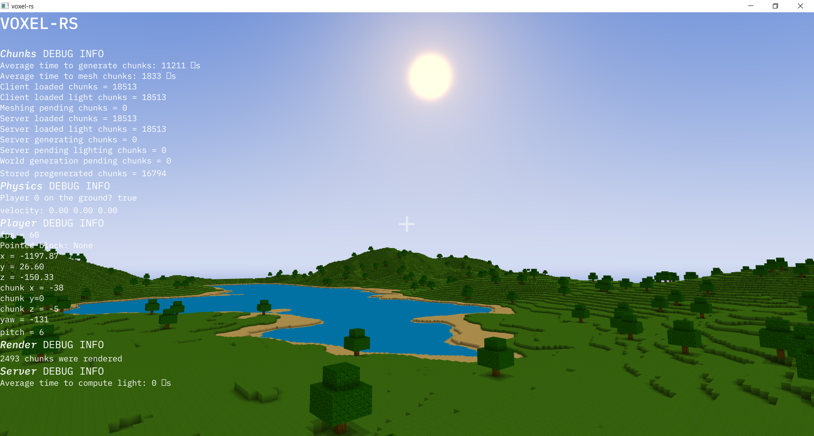

[voxel-rs] is a new multiplayer Minecraft-like sandbox game engine
written in Rust using [wgpu-rs].

> The game is currently under heavy development and it's not yet playable.

The project's roadmap is [here][voxel-rs-roadmap].

_Discussion:
[/r/rust](https://reddit.com/r/rust/comments/e9qqnv/in_the_works_minecraftlike_game_written_in_rust)_

[voxel-rs]: https://github.com/Technici4n/voxel-rs
[voxel-rs-roadmap]: https://github.com/Technici4n/voxel-rs#roadmap
[wgpu-rs]: https://github.com/gfx-rs/wgpu-rs

### [Tennis Academy: Dash]

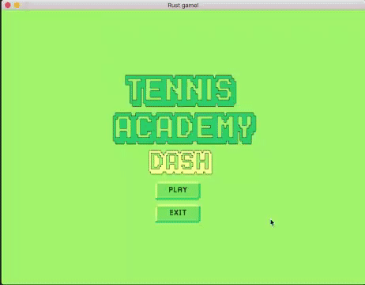

[@oliviff] released [v0.1.2][tennis-academy-v0-1-2]..[v0.1.4][tennis-academy-v0-1-4]
versions of "[Tennis Academy: Dash]":

- 🖼️ art redesign, & new colour palette;
- ✂️ spritesheet and assets packing;
- 🧮 the game finally has a name: "Tennis Academy: Dash";
- ⛱️ logo, splash screen, and UI polish.

[@oliviff]: https://twitter.com/oliviff
[Tennis Academy: Dash]: https://iolivia.me/posts/6-months-of-rust-game-dev
[tennis-academy-v0-1-2]: https://twitter.com/oliviff/status/1205891407606636544
[tennis-academy-v0-1-4]: https://twitter.com/oliviff/status/1207671483981537280

### [Dank Defense][dank-defense]

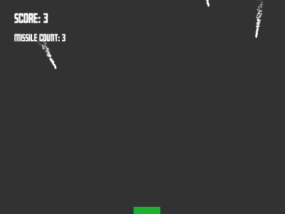

[Dank Defense][dank-defense] by [Elijah Lucian]
is a fun little missle defense game made in Rust using [ggez].

[dank-defense]: https://elijahlucian.itch.io/dank-defense-theyre-coming
[Elijah Lucian]: https://twitter.com/ELI7VHBO7
[ggez]: https://github.com/ggez/ggez

### [Akigi][akigi]

[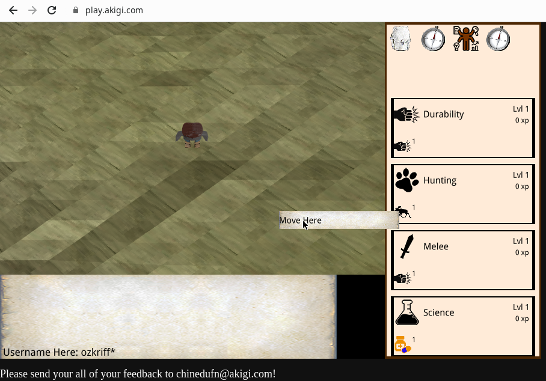][akigi]

> [Akigi][akigi] is a multiplayer online world where most believe that
> humans are inferior.

Some of December's updates:

- The game server was ported to [specs];
- The spawning system was rewritten and simplified;
- Initial scenery setup using YAML config files;
- Pathfinding now works between arbitrarily sized sets of tiles;
- Better test coverage;

Full December's devlogs:
[#046](https://devjournal.akigi.com/december-2019/2019-12-15.html),
[#047](https://devjournal.akigi.com/december-2019/2019-12-22.html),
[#048](https://devjournal.akigi.com/december-2019/2019-12-29.html).

_Discussions:
[/r/rust_gamedev](https://reddit.com/r/rust_gamedev/comments/eejnyl/akigi_rust_wasm_webgl_game_dev_journal_047)_

[akigi]: https://akigi.com
[specs]: https://github.com/amethyst/specs

### [Garden Devlog: December][garden-dec]

[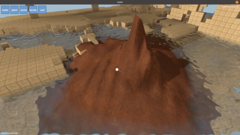][garden-video]
_new smooth soil editing demo_

[Garden][garden] is an upcoming game centered around growing realistic plants.

Some of December's updates:

- a new terrain system that doesn't use voxels with surface nets anymore,
  but regular cubic voxels with heightmaps ([video][garden-video]);
- new building materials;
- improved rendering performance and compilation time;

[garden]: https://epcc.itch.io/garden
[garden-dec]: https://cyberplant.xyz/posts/december
[garden-video]: https://youtube.com/watch?v=xU93FGrk1d8

### [Slavic Castles][slavic-castles]

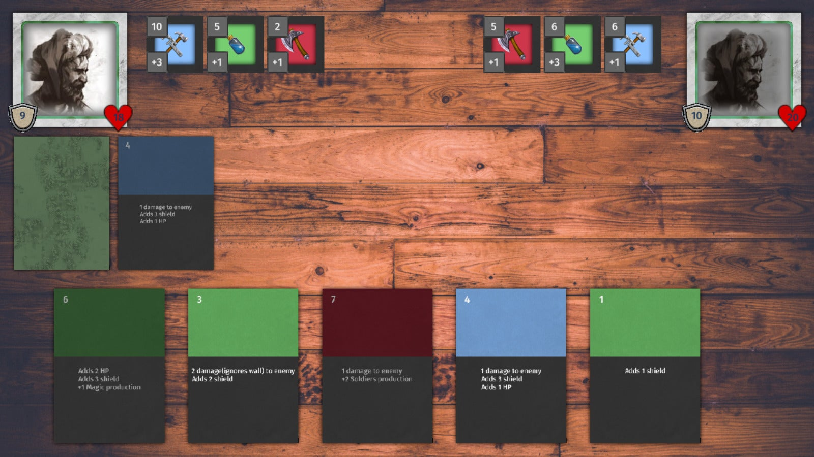

[Slavic Castles][slavic-castles] is a card game inspired by [Arcomage].

The following changes were made since the last devlog:

- real cards that are loaded from JSON file;
- the project migrated to [quicksilver];
- menu, simple animations and visual & audio feedback;
- ability to save the game state.

_Discussions:
[/r/rust_gamedev](https://reddit.com/r/rust_gamedev/comments/e4isx9/card_game_progress)_

[slavic-castles]: https://leinnan.itch.io/slavic-castles
[Arcomage]: https://en.wikipedia.org/wiki/Arcomage
[quicksilver]: https://github.com/ryanisaacg/quicksilver

### [Robo Instructus]

[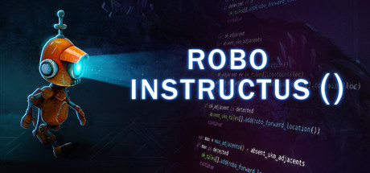][Robo Instructus]

[Alex Butler] continues to polish their "[Robo Instructus]" puzzle game -
[1.18, 1.19, and 1.20 versions were released][robo-news]:
UI tweaks, better translations (including full Russian translation!),
bugfixes, and performance optimizations.

[Alex Butler]: https://twitter.com/bigabgames
[Robo Instructus]: https://store.steampowered.com/app/1032170/Robo_Instructus
[robo-news]: https://steamcommunity.com/app/1032170/allnews

### [Amethyst] Games

- [Azriel] published an ["I See The Character In UI"][will-devlog] devlog:

  - Character selection UI displays the character that the player will use.
  - Control settings UI allows players to view the configured control keys.
  - User interfaces (UIs) are largely defined through configuration,
    making development and customization easier.
  - Events to control application behaviour can be defined in configuration.

  [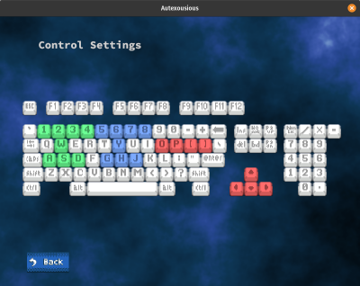][will-video]

- [@dave_tucker] is reimplementing some classics.

  [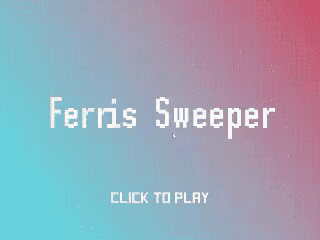](https://twitter.com/dave_tucker/status/1208103971044438017)

- [@carlosupina] has been adding animations and boss enemies to [Space Shooter];

  [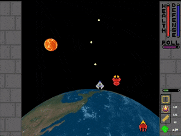][space-shooter-tweet]

- [@a5huynh] got the rotating map working;

  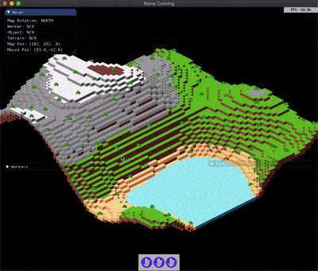

[Amethyst]: https://amethyst.rs
[Azriel]: https://azriel.im
[will-devlog]: https://azriel.im/will/2019/12/20/i-see-the-character-in-ui
[will-video]: https://youtube.com/watch?v=aQiK5rOylCY
[@dave_tucker]: https://twitter.com/dave_tucker
[@carlosupina]: https://twitter.com/carlosupina
[space-shooter-tweet]: https://twitter.com/carlosupina/status/1208128889891033095
[Space Shooter]: https://github.com/amethyst/space_shooter_rs
[@a5huynh]: https://twitter.com/a5huynh

## Library & Tooling updates

### [ultraviolet v0.4][ultraviolet-v0-4]


[ultraviolet] is a crate for computer-graphics and games-related linear algebra,
but _fast_, both in terms of productivity and in terms of runtime performance.

This month [ultraviolet v0.4][ultraviolet-v0-4] was released by [@fu5ha].
It brings
[transform](https://docs.rs/ultraviolet/0.4.3/ultraviolet/transform/index.html)
& [projection](https://docs.rs/ultraviolet/0.4.3/ultraviolet/projection/index.html)
modules and many smaller improvements.

Check out the [full release announcement post][ultraviolet-v0-4].

[ultraviolet]: https://crates.io/crates/ultraviolet
[ultraviolet-v0-4]: https://grayolson.me/blog/posts/ultraviolet-0.4
[@fu5ha]: https://twitter.com/fu5ha

### [component_group] v0.2

[component_group] is a crate for working with a group of [specs]::Components.

> This crate defines the [ComponentGroup] trait.
> This trait is used to make managing a group of `specs::Component` instances easier.
> This is useful when you have several components that are often
> created, read, and updated together.
> You can use this trait to easily move an entire group of components
> between instances of specs::World.

[component_group]: https://github.com/sunjay/component_group
[ComponentGroup]: https://docs.rs/component_group/2.0.0/component_group/trait.ComponentGroup.html

### [A Thought Experiment: Using an ECS Outside of Game Engines][non-game-ecs]

[This article][non-game-ecs] by [Michael Bryan] discusses
the usage of the ECS pattern in a [CAD] library.
It's obviously not about games,
but it still can be interesting for some game developers.

_Discussions:
[/r/rust](https://reddit.com/r/rust/comments/egcvil/a_thought_experiment_using_an_ecs_outside_of_game)_

[non-game-ecs]: http://adventures.michaelfbryan.com/posts/ecs-outside-of-games
[Michael Bryan]: http://adventures.michaelfbryan.com
[CAD]: https://en.wikipedia.org/wiki/Computer-aided_design

### [Lyon v0.15][lyon-v0-15]

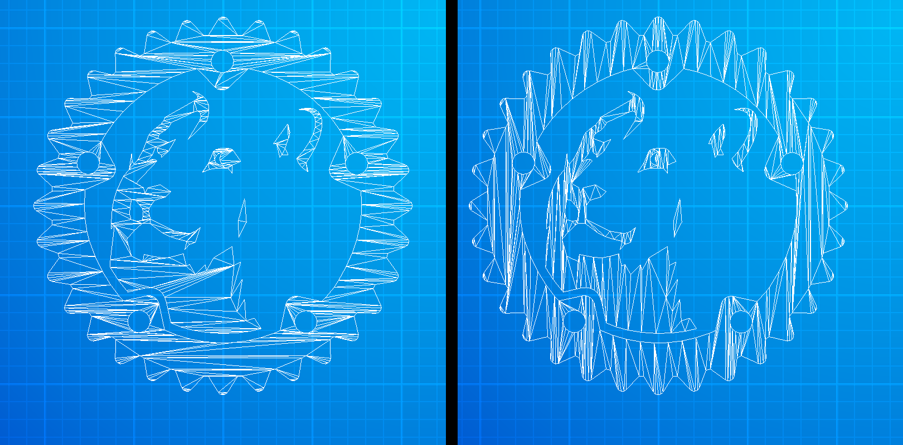

[Lyon][lyon] a rust crate to tessellate arbitrary 2D shapes into
triangle meshes that can be easily rendered on the GPU.

This month [@nical] released [Lyon 0.15][lyon-v0-15].
The fill tessellator was rewritten from scratch (it took two years),
it should solve robustness issues the previous implementation had
and also has a bunch of new features.

Check out the [full release announcement post][lyon-v0-15].

_Discussions:
[/r/rust](https://reddit.com/r/rust/comments/efz5jb/lyon_0150_a_new_tessellator)_

[lyon-v0-15]: https://nical.github.io/posts/new-tessellator.html
[lyon]: https://github.com/nical/lyon
[@nical]: https://nical.github.io

### [winit v0.20-alpha and Web Support][winit-0-20-web]

[winit] is a pure-Rust library for creating and managing windows.

A new alpha release of winit brings the web support.
The web version expectedly has some API limitations
(like window decorations, resizing, fullscreen, etc).

> Web support is very much in alpha, and we'd like to encourage you
> to try it out and stress-test it so we can see where
> the issues are and improve where necessary.

Check out [the announcement post][winit-0-20-web].

_Discussions:
[/r/rust](https://reddit.com/r/rust/comments/efz0rm/winit_020_and_web_support)_

[winit-0-20-web]: https://users.rust-lang.org/t/winit-0-20-and-web-support/36155
[winit]: https://github.com/rust-windowing/winit

### [The State Of GGEZ 2020][ggez2020]


[ggez] is a lightweight game framework for making 2D games with minimum friction,
inspired by [love2D].

[Icefox] published ["The State Of GGEZ 2020"][ggez2020] blog post
with an overview of what happened in ggez's development this year,
what is the current ggez 0.6 development status,
what's in the roadmap, and thoughts about the Rust ecosystem.

_Discussions:
[/r/rust](https://reddit.com/r/rust/comments/eh7wkx/the_state_of_ggez_2020)_

[Icefox]: https://github.com/icefoxen
[ggez2020]: https://wiki.alopex.li/TheStateOfGGEZ2020
[love2D]: https://love2d.org

### [miniquad]

[][miniquad]

[miniquad] by [@fedor_games] is a safe cross-platform rendering library
focused on portability and low-end platforms support.

Web demos:
[quad](https://not-fl3.github.io/miniquad-samples/quad.html),
[offscreen](https://not-fl3.github.io/miniquad-samples/offscreen.html),
[astroblasto](https://not-fl3.github.io/miniquad-samples/astroblasto.html),
[arkanoid](https://not-fl3.github.io/miniquad-samples/arkanoid.html),
[zemeroth](https://not-fl3.github.io/miniquad-samples/zemeroth.html).

[sokol]: https://github.com/floooh/sokol

------

[@fedor_games] also posted a few Patreon updates this month:

- ["Status update"](https://patreon.com/posts/32234274);
- ["Rust 2D Engine, Rendering revisited"](https://patreon.com/posts/rust-2d-engine-32439672);

[miniquad]: https://github.com/not-fl3/miniquad
[@fedor_games]: https://twitter.com/fedor_games
[good-web-game]: https://github.com/not-fl3/good-web-game

### [Godot] and Rust

After a year of work [godot-rust] 0.7 bindings were released.
Some of the updates:

- Rust 2018;
- The API description of Godot classes was updated to the stable Godot version 3.1.1;
- More helper traits and  derive/procedural macroses to reduce the boilerplate;
- Iterators for Godot collection types;
- New example projects;

[godot-rust]: https://github.com/GodotNativeTools/godot-rust

------

Also, check out [a Godot-Specs example project][godot-specs]
by [@RecallSingularity].

[Godot]: https://godotengine.org
[@RecallSingularity]: https://twitter.com/RecallSingular1
[godot-specs]: https://github.com/tom-leys/godot-rust/tree/feature_specs_integration_example/examples/specs_integration

### [raylib-rs]

[][raylib-rs]

[raylib] is a simple C 2D/3D game engine with virtually no dependencies.
This month, [raylib-rs] 1.0 was released - mostly idiomatic
and thread-safe Rust raylib bindings.

[Check out an example of a roguelike game here][raylib-rs-rl].

_Discussions:
[/r/rust_gamedev](https://reddit.com/r/rust_gamedev/comments/ednyyz/check_out_raylibrs_rust_bindings_for_the_raylib)_

[raylib-rs]: https://github.com/deltaphc/raylib-rs
[raylib]: https://raylib.com
[raylib-rs-rl]: https://github.com/deltaphc/raylib-rs/blob/7e387774c/samples/roguelike.rs

### [Makepad][makepad]

[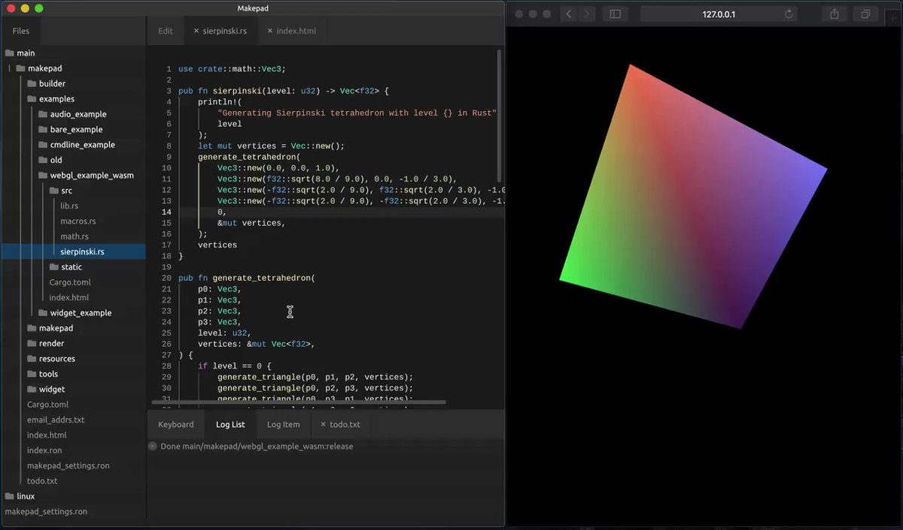][makepad]

[Makepad][makepad] is a creative software development platform for Rust
that compiles to WASM/WebGL, macOS/Metal, Windows/DX11, Linux/OpenGL.

An early alpha version of Makepad Basic was launched.
This version shows off the development platform,
but does not include the visual design tools or library ecosystem yet.

Play with Rust+Wasm live at [makepad.nl][makepad].

_Discussions:
[/r/rust](https://reddit.com/r/rust/comments/e6zcp3/introducing_makepad_live_editing)_

[makepad]: http://makepad.nl

### [Tetra][tetra] v0.3

[Tetra][tetra-site] is a simple 2D game framework
that uses SDL2 for event handling and OpenGL 3.2+ for rendering.

This month, [@17cupsofcoffee] has released Tetra v0.3.
Main changes are:

- [nalgebra] linalg library was replaced with [vek];
- Improved window/input events;
- Improved cameras/transform matrices;
- More flexible screen scaling;
- Better error handling;

[Read the full changelog here][tetra-changes].

[tetra-site]: https://tetra.seventeencups.net
[tetra]: https://github.com/17cupsofcoffee/tetra
[@17cupsofcoffee]: https://twitter.com/17cupsofcoffee
[tetra-changes]: https://github.com/17cupsofcoffee/tetra/blob/master/CHANGELOG.md
[nalgebra]: https://nalgebra.org
[vek]: https://github.com/yoanlcq/vek

------

[@17cupsofcoffee] also posted [a little example][tetra-sound-polling-ex]
of how you can implement pooling for sound effects

> This is handy for situations where you don't want more than X instances
> of the same sound playing at once
> (e.g. if the player is able to fire a weapon as fast as they can hit a button),
> etc...

[tetra-sound-polling-ex]: https://gist.github.com/17cupsofcoffee/f5082a13626ddf0030075d542262c728

------

[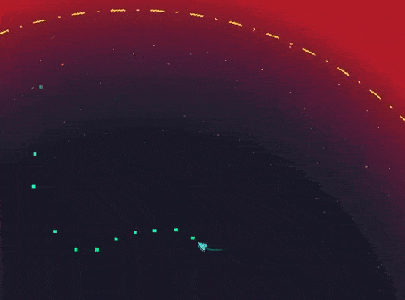][compact-space]

[@puppetmaster updated their "Compact Space" game][compact-space-tweet]
to Tetra 0.3, added some sound effects and a little x-max surprise.

[compact-space]: https://puppetmaster.itch.io/compact-space
[compact-space-tweet]: https://twitter.com/fischspiele/status/1206014736300728322

------

[@JohanLindfors] updated their [Snake][tetra-snake]
and [Flappy Bird][tetra-flappy] sample games to Tetra 0.3.

Also, the Snake sample now has
[a ten step tutorial on how to build it from scratch][tetra-snake-tutorial].

[@JohanLindfors]: https://twitter.com/JohanLindfors
[tetra-snake]: https://github.com/programmeramera/snake-in-tetra
[tetra-snake-tutorial]: https://github.com/programmeramera/snake-in-tetra/tree/5c7cc79f8/tutorial
[tetra-flappy]: https://github.com/programmeramera/flappy-in-rust

### [rg3d-sound]

[rg3d-sound] is a new sound library in active development.

This month it has gained three major features:

- [Head-related transfer function] support - it provides perfect binaural sound.
  Try it: `cargo run --example hrtf --release`
- [Reverberation] support - basic effect that gives your scene "sound volume".
  Try it: `cargo run --example reverb --release`
- [Vorbis/ogg][ogg] support - a compressed format similar to mp3.

[rg3d-sound] is a component of the [rg3d] game engine.

[rg3d-sound]: https://github.com/mrDIMAS/rg3d-sound
[Head-related transfer function]: https://en.wikipedia.org/wiki/Head-related_transfer_function
[Reverberation]: https://en.wikipedia.org/wiki/Reverberation
[ogg]: https://en.wikipedia.org/wiki/Vorbis
[rg3d]: https://github.com/mrDIMAS/rg3d

### @siebencorgie's Voxel Engine

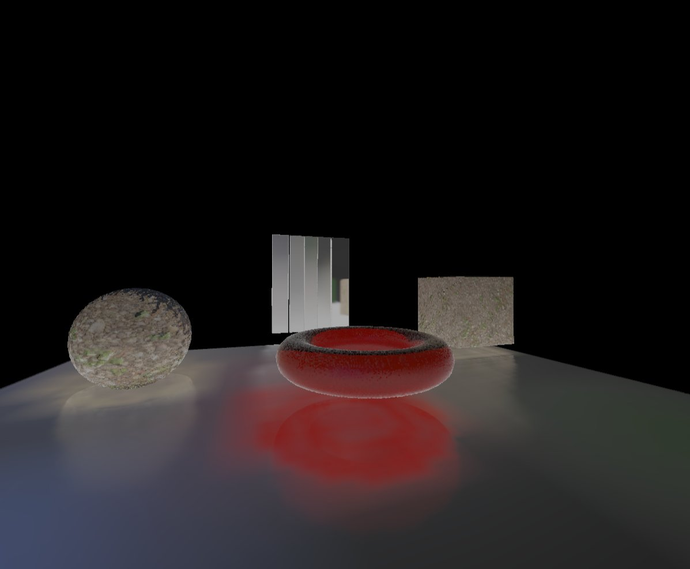

[@siebencorgie] got [voxel global illumination]
and [voxel cone traced reflections] working in their voxel engine.

[voxel cone traced reflections]: https://twitter.com/siebencorgie/status/1201171106641698816
[voxel global illumination]: https://twitter.com/siebencorgie/status/1209086915925991425

[@siebencorgie]: https://twitter.com/siebencorgie

### [Introduction to Rendology][rendology-into]

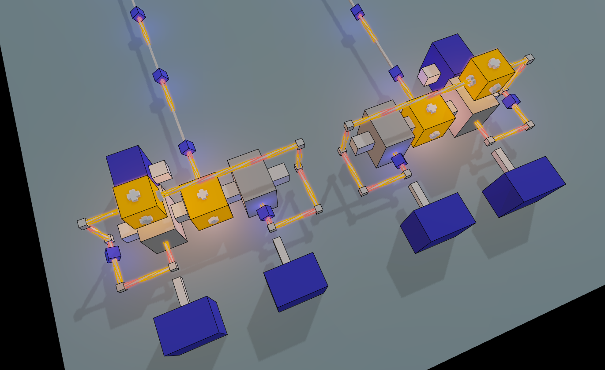

[Rendology] is a 3D rendering pipeline based on Glium and written in Rust.
It features basic implementations of shadow mapping, deferred shading,
a glow effect, FXAA and instanced rendering.

An ["Introduction to Rendology"][rendology-into] article
outlines some of the concepts of Rendology
and describes how they came to be this way.

_Discussions:
[/r/rust](https://reddit.com/r/rust/comments/eaj6su/introduction_to_rendology_a_gliumbased_rendering)_

[rendology-into]: https://leod.github.io/rust/gamedev/rendology/2019/12/13/introduction-to-rendology.html
[Rendology]: https://github.com/leod/rendology

### [Oxygengine][oxygengine] v0.5


[Oxygengine][oxygengine] is
"the hottest HTML5 + WASM game engine for games written in Rust with web-sys".

Main updates of v0.5 version:

- Automated asset packs generation on build phase;
- Loading assets from asset packs;
- Support for audio: sound effects (buffered) and background music > (streaming);
- Support for 2D physics (rigid bodies and colliders) via [nphysics2d];
- A new example: [a basic web game][oxygengine-example].

_Discussions:
[/r/rust](https://reddit.com/r/rust/comments/ei8754/oxygengine_v050_2020_edition_release_of_the)_

[oxygengine]: <https://github.com/PsichiX/Oxygengine>
[oxygengine-example]: https://github.com/PsichiX/Oxygengine/tree/master/demos/basic-web-game
[nphysics2d]: https://nphysics.org/

### [This Month in Mun - December 2019][mun-dec-2019]


[Mun] is a scripting language for gamedev focused on quick iteration times
that is written in Rust.

[December updates][mun-dec-2019] include:

- Parsing of tuple data structures;
- Parsing and type inferencing of data structure literals;
- Indexing of data structure fields;
- Improved handling of data structure information;
- Type checking of binary operations;
- A community member made a PoC of Mun-powered hot reloading
  in [Veloren][veloren];

[mun-dec-2019]: https://mun-lang.org/blog/2020/1/1/this-month-december
[Mun]: https://mun-lang.org

### [Rust Roguelike Tutorial][roguelike-book]

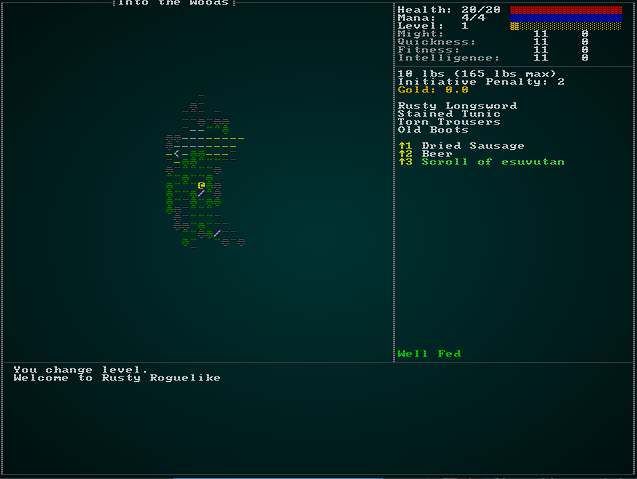

[The Roguelike Tutorial][roguelike-book] by [@blackfuture]
includes almost 70 chapters now and continues to grow!

Some of the December's updates:

- item identification and magical weapons;
- a generic "effects" system;
- cursed items, scrolls of remove curse, and item identification scrolls;
- items that affect your attributes, generic statuses;
- spells, spellbooks, weapon proc fx, mob special abilities,
    DoT, initiative +/- effects;
- a dragon lair in a ruined fort;
- multi-tile entities including pathfinding;
- parameterized procgen of magic weaponry/armor;

Also, check out
[@blackfuture's 2019 Roguelike Development Retrospective post][rl-retro].

[roguelike-book]: http://bfnightly.bracketproductions.com/rustbook
[@blackfuture]: https://patreon.com/blackfuture
[rl-retro]: https://reddit.com/r/roguelikedev/comments/eij9nl/2020_in_roguelikedev_one_knight_in_the_dungeon

### [doryen-rs] v1.2.1

[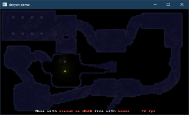][doryen-demo]

[doryen-rs] is an ASCII roguelike library with native and WASM support.
Uses the uni-gl and uni-app crates from the [unrust] game engine.

[doryen-rs] v1.2.1 was released this month.
Some of the new features:

- added InputApi.keys_released() and InputApi.keys_pressed()
  that return iterators on key events since last update;
- added alpha example showcasing framebuffer overdrawing;
- added text input support through InputApi.text();
- added a visual demo showcasing subcell resolution + dynamic lighting
  in a real time roguelike;

[doryen-rs]: https://github.com/jice-nospam/doryen-rs
[unrust]: http://github.com/unrust/unrust
[doryen-demo]: https://jice-nospam.github.io/doryen-rs/docs/demo

### [nes-rust][rust-nes-src] - WASM [NES] Emulator

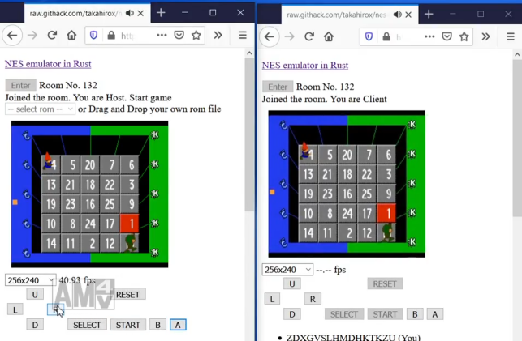

[nes-rust][rust-nes-src] by [@superhoge] -
[NES] \(Famicom) emulator in Rust on the Web, compiled to WASM.

This month nes-rust got remote multiplay:

> Once you enter a room, share the URL with someone
> and start the game you want to play with them. Enjoy!

[Try it!](https://raw.githack.com/takahirox/nes-rust/WebRTC/multiplay.html)

[NES]: https://en.wikipedia.org/wiki/Nintendo_Entertainment_System
[rust-nes-demo]: https://raw.githack.com/takahirox/nes-rust/master/index.html
[rust-nes-src]: https://github.com/takahirox/nes-rust
[@superhoge]: https://twitter.com/superhoge

### [rx v0.3][rx]


> [rx] is an extensible, modern and minimalist pixel editor,
> designed with great care and love for artists and hackers.
> It was conceived to have as little UI as possible,
> and instead focus on the work.

The 0.3 release comes with:

- [vim-like visual mode][rx-visual],
- a [new website][rx],
- and a [user guide][rx-guide]!

_Discussions:
[/r/rust](https://reddit.com/r/rust/comments/eh6it4/rx_v03_released_with_user_guide_a_modern_pixel)_

[rx]: https://rx.cloudhead.io
[rx-visual]: https://rx.cloudhead.io/videos/manipulating.webm
[rx-guide]: https://rx.cloudhead.io/guide.html

### [Texel][texel] - ASCII Art Editor

[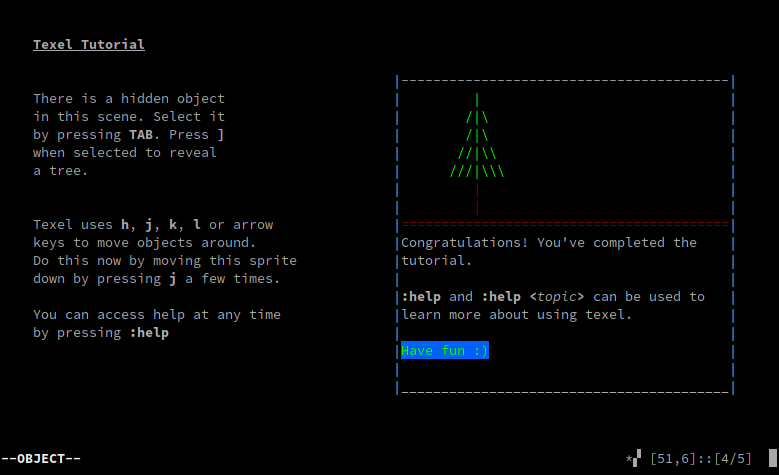][texel]

[Texel][texel] is an ASCII art and landscape editor with VIM-like controls.
It aims to make editing ASCII art easy especially for use in games.

_Discussions:
[/r/rust](https://reddit.com/r/rust/comments/ebmbt2/introducing_texel_ascii_art_editor)_

[texel]: https://github.com/almindor/texel

### [Embark: Developer Newsletter 002][embark-2]


[Embark] posted [the second issue of their newsletter][embark-2].
Here're some of the Rust news from it:

- ["Inside Rust at Embark 🦀"][inside-rust] - a peek inside Embark's
  day-to-day work with Rust and open source gamedev
  ([/r/rust](https://reddit.com/r/rust/comments/e7120k/inside_rust_at_embark));
- [cargo-about] - a cargo plugin to generate list of all licenses for a crate
  ([/r/rust](https://www.reddit.com/r/rust/comments/e74uux/embarkstudioscargoabout_cargo_plugin_to_generate))

[Embark]: https://embark.rs
[embark-2]: https://us20.campaign-archive.com/?u=4206f0696b8b13a996c701852&id=0339af3ed2
[inside-rust]: https://medium.com/embarkstudios/inside-rust-at-embark-b82c06d1d9f4
[cargo-about]: https://github.com/embarkstudios/cargo-about

## Popular Workgroup Issues in Github

<!-- Up to 10 links to interesting issues -->

- [#32 "Selective Enabling/Disabling optimizations at a crate/file/function level"](https://github.com/rust-gamedev/wg/issues/32);
- [#46 "Make sure key crates have `crev` code reviews"](https://github.com/rust-gamedev/wg/issues/46);
- [#69 "Input Handling"](https://github.com/rust-gamedev/wg/issues/69);
- [#71" Proof Of Concept Crate: Simplistic Bump Allocator"](https://github.com/rust-gamedev/wg/issues/71);
- [#75 "Standardised API for sharing thread pools"](https://github.com/rust-gamedev/wg/issues/75);
- [#77 "Can we contribute to OpenXR to get Keyboard/Mouse support to be official?"](https://github.com/rust-gamedev/wg/issues/77);
- [#79 "Polymorph project"](https://github.com/rust-gamedev/wg/issues/79);

## Meeting Minutes

<!-- Up to 10 most important notes + a link to the full details -->

[See all meeting issues][label_meeting] including full text notes
or [join the next meeting][join].

[label_meeting]: https://github.com/rust-gamedev/wg/issues?q=label%3Ameeting

## Requests for Contribution

<!-- Links to "good first issue"-labels or direct links to specific tasks -->

- [Embark's open issues][embark-open-issues] ([embark.rs]);
- [winit's "Good first issue" and “help wanted” issues][winit-issues];
- [gfx-rs's "contributor-friendly" issues][gfx-issues];
- [wgpu's "help wanted" issues][wgpu-help-wanted];
- [luminance's "low hanging fruit" issues][luminance-fruits];
- [ggez's "good first issue" issues][ggez-issues];
- [Veloren's "beginner" issues][veloren-beginner];
- [Amethyst's "good first issue" issues][amethyst-issues];
- [A/B Street's "good first issue" issues][abstreet-issues];

[embark.rs]: https://embark.rs
[embark-open-issues]: https://github.com/search?q=user:EmbarkStudios+state:open
[winit-issues]: https://github.com/rust-windowing/winit/issues?utf8=✓&q=is%3Aissue+is%3Aopen+label%3A%22status%3A+help+wanted%22+label%3A%22Good+first+issue%22
[gfx-issues]: https://github.com/gfx-rs/gfx/issues?q=is%3Aissue+is%3Aopen+label%3Acontributor-friendly
[wgpu-help-wanted]: https://github.com/gfx-rs/wgpu-rs/issues?q=is%3Aissue+is%3Aopen+label%3A%22help+wanted%22
[luminance-fruits]: https://github.com/phaazon/luminance-rs/issues?q=is%3Aissue+is%3Aopen+label%3A%22low+hanging+fruit%22
[ggez-issues]: https://github.com/ggez/ggez/labels/%2AGOOD%20FIRST%20ISSUE%2A
[veloren-beginner]: https://gitlab.com/veloren/veloren/issues?label_name=beginner
[amethyst-issues]: https://github.com/amethyst/amethyst/issues?q=is%3Aissue+is%3Aopen+label%3A%22good+first+issue%22
[abstreet-issues]: https://github.com/dabreegster/abstreet/issues?q=is%3Aissue+is%3Aopen+label%3A%22good+first+issue%22

## Bonus

<!-- Bonus section to make the newsletter more interesting
and highlight events from the past. -->

Just an interesting Rust gamedev link from the past. :)

[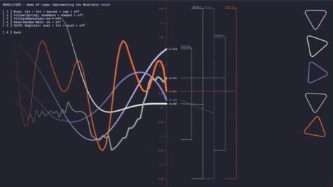][modulator-video]
_click to see [the tutorial video][modulator-video]_

In the November of 2018,
[@AndreaPessino] (Founder/CTO of [Ready At Dawn] Studios)
released a [Modulator] crate and an awesome
["Modulator (Rust conding series)"][modulator-video] tutorial video about it.

[Modulator] is a Rust crate for abstracted, decoupled modulation sources.

> Modulators are sources of change over time which exist
> independently of the parameters they affect, their destinations.

Modulator comes with playground/testbed application [Modulator Play]:

> An environment to visualize and test the modulator crate and to experiment
> with expressive 2d primitive rendering.
> Based on Piston Window, this application is meant to be both a test bed
> for the Modulator crate and its included source types,
> and a minimal friction environment to experiment with Rust coding.

_Discussions:
[/r/rust](https://www.reddit.com/r/rust/comments/9zem4v/modulator_andrea_pessino_on_twitter)_

[@AndreaPessino]: https://twitter.com/AndreaPessino
[Ready At Dawn]: https://readyatdawn.com
[Modulator]: https://github.com/apessino/modulator
[modulator-video]: https://youtube.com/watch?v=n-txrCMvdms
[Modulator Play]: https://github.com/apessino/modulator_play

------

That's all news for today, thanks for reading!

Subscribe to [@rust_gamedev on Twitter][@rust_gamedev]
or [/r/rust_gamedev subreddit][/r/rust_gamedev] if you want to receive fresh news!

**Discussions of this post**:
[/r/rust](https://reddit.com/r/rust/comments/en7tki/this_month_in_rust_gamedev_5_december_2019),
[twitter](https://twitter.com/rust_gamedev/status/1215998150118461440).

[/r/rust_gamedev]: https://reddit.com/r/rust_gamedev
[@rust_gamedev]: https://twitter.com/rust_gamedev
